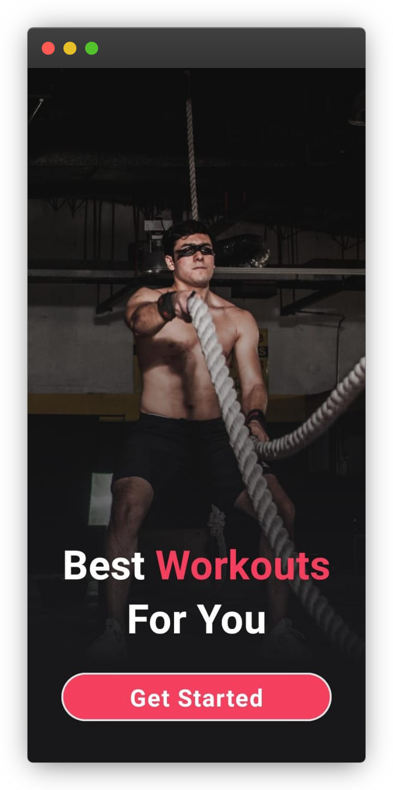
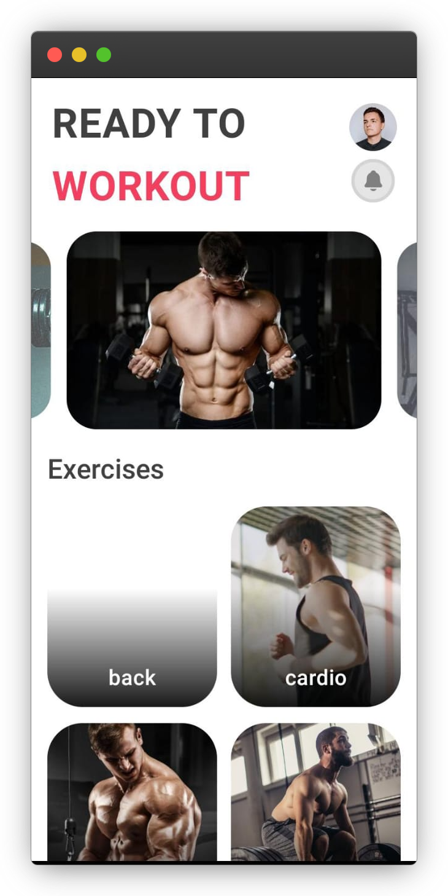
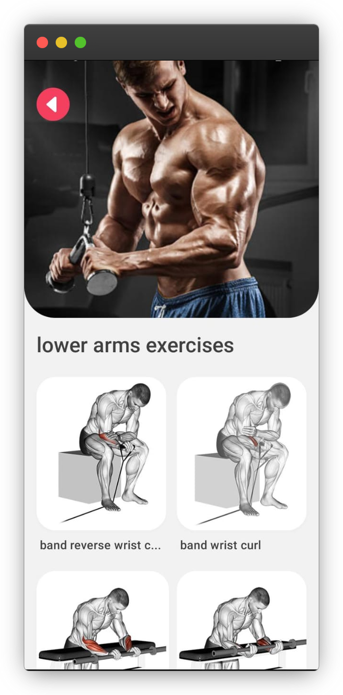
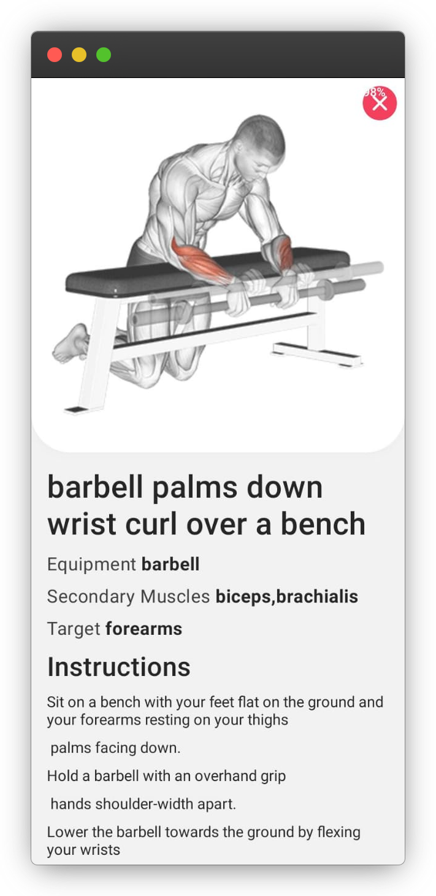

# FitBit - Your Ultimate Fitness Companion

## Introduction

Welcome to FitBit, your go-to fitness app built with React Native and powered by Expo. This app is designed to be your ultimate fitness companion, helping you achieve your fitness goals by providing a seamless experience to view and follow body part exercises. Whether you're a fitness enthusiast or a beginner, FitBit is here to support you on your fitness journey.

## Features

### 1. Body Part Exercises

- **Explore**: Browse a wide range of exercises categorized by body parts.
- **Detailed Instructions**: Access detailed instructions for each exercise to ensure proper form and technique.
- **Visual Demonstrations**: Watch visuals demonstrations to visualize and understand each exercise.

### 2. User-Friendly Interface

- **Intuitive Design**: Enjoy a clean and user-friendly interface for a seamless user experience.
- **Easy Navigation**: Navigate effortlessly between exercises, workouts, and other app features.

## Technologies

- **@expo/vector-icons**: Beautiful icons for your Expo projects.
- **@react-navigation/native**: Popular navigation library for React Native.
- **axios**: Promise-based HTTP client for requests.
- **expo**: Framework simplifying React Native development.
- **expo-font**: Enables loading custom fonts in Expo projects.
- **react-native-gesture-handler**: Library for handling gestures.
- **react-native-reanimated**: Facilitates smooth animations.
- **react-native-vector-icons**: Allows using custom vector icons.
- **react-native-snap-carousel**: Carousel component for React Native.
- **tailwindcss**: Utility-first CSS framework for responsive web apps.

## Getting Started

### Prerequisites

- Ensure you have [Node.js](https://nodejs.org/) installed.
- Install Expo CLI globally: `npm install -g expo-cli`.

### Installation

1. Clone the repository: `git clone https://github.com/ZeeshanMukhtar1/FitBit.git`
2. Navigate to the project directory: `cd FitBit`
3. Install dependencies: `npm install`

### Running the App

- Use Expo CLI to run the app: `expo start`
- Follow the instructions in the console to open the app on an emulator or physical device.

## Support and Feedback

If you have any questions, issues, or feedback, feel free to [open an issue](https://github.com/ZeeshanMukhtar1/FitBit/issues). We welcome your input to make FitBit even better!

## Contribute

Contributions are welcome! If you'd like to contribute to the development of FitBit, please [open a pull request](https://github.com/ZeeshanMukhtar1/FitBit/pulls)

## Screenshots

  
  
  
  

## Acknowledgements

This is project is by following [This tutorial](https://youtu.be/gFvFGzzjdT4?si=Xn7d38RGRPDN3Z7w)

**FitBit - Empowering Your Fitness Journey**
